# Multi-Modal-Video-Analytics-Guidance

## Introduction
This asset is leverage large language models (LLMs) for intelligent video analysis. LLMs can analyze video content in real-time, identify abnormal or dangerous behaviors, and generate alerts for rapid response and assist in analyzing video content, recognizing violations, and quickly locating relevant footage for security personnel. Meanwhile, LLMs can provide multi-modal capabilities to query specific video content enabling users to quickly locate and resolve issues during device configuration and troubleshooting through video and text explanations. This solution combines AWS lambda functions, model repositories, integrating video data from cameras and edge devices to achieve analytics pipeline and function.  

## Architecture

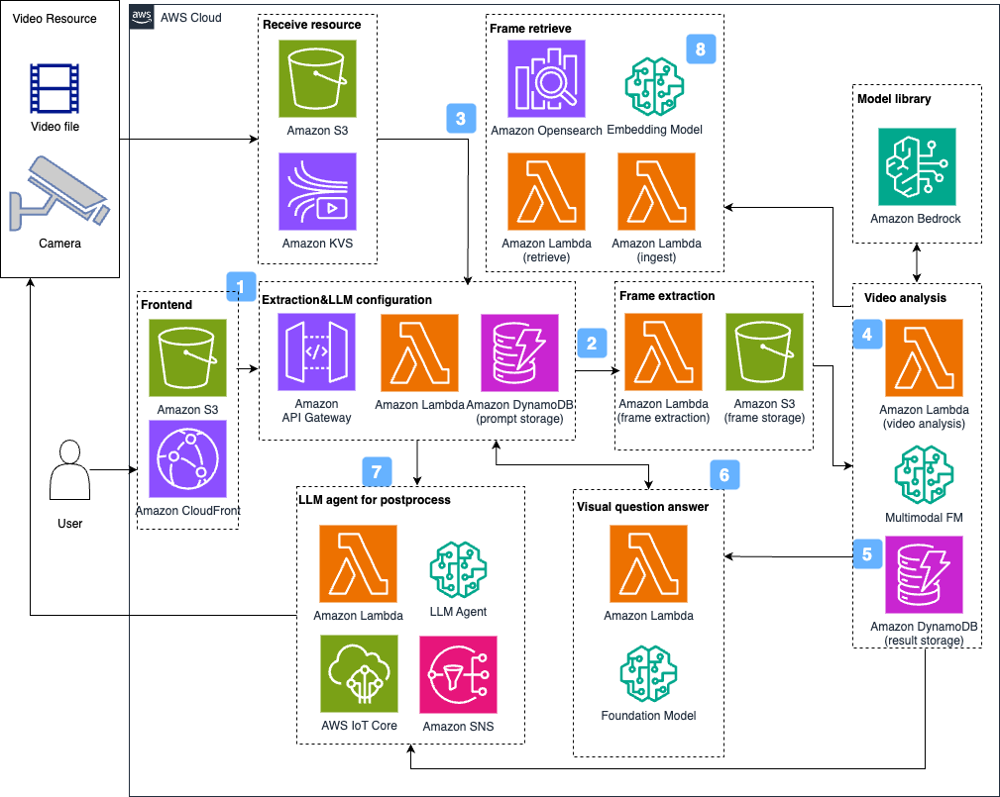

1. Users obtain data, edit prompts, perform analysis, and set post-processing operations on the website deployed on Amazon CloudFront & S3.
2. The overall architecture follows a decoupled frontend and backend design, where the frontend website passes requests to Amazon API Gateway and receives responses from API Gateway.
3. API Gateway routes requests to the video stream/file and upload component, which integrates video data from IP cameras through Amazon Kinesis Video Streams for stream
4. API Gateway forwards analysis requests containing video frames and prompts to the visual analysis component. This component is equipped with Amazon Lambda for frame extraction and LLM invoke, frame image store at Amazon Simple Storage Service (Amazon S3)
5. Users can store videos analysis result & prompts topics in Amazon DynamoDB
6. Users can query intermediate results of video analysis to for QA via Amazon Bedrock chatbot, it can then engage in question-and-answer sessions based on the video content on the website using LLM.
7. If the user sets post-processing operations through natural language input, the LLM agent will execute these operations through multiple Amazon Lambda functions, such as sending notifications or control command to edge devices.
8. User could search frame images by keyword, Amazon opensearch stores frame vector information from video, and multimodal embedding model titan/cohere will offer the vectorization capacity.

## Demo Environment
**Demo Link** [click here](https://[doi9l2geomyf6.cloudfront.net](https://multimodal.mfg.industry.gcr.aws.dev/))  
For internal user:   
SSO login via isengard account  
For external user:  
username *`lluli`*  
password *`P@ssw0rd`*  

## Deploy Guideline

## Deployment Prerequisite

1. AWS credential is ready such as aws configure or environment, prefer administrator permission and us-east-1 or us-west-2 region. reference https://docs.aws.amazon.com/cli/latest/userguide/cli-configure-envvars.html

2. AWS CDK v2 for python is ready, reference https://docs.aws.amazon.com/zh_cn/cdk/v2/guide/getting_started.html

3. Python boto3 is ready, reference https://boto3.amazonaws.com/v1/documentation/api/latest/guide/quickstart.html#installation
4. Ensure bedrock Anthropic Claude models permission. Model recommendation: Claude3.5 sonnet and Claude3 haiku for video analysis/postprocess, titan-multimodal-embedding-v1 for embedding. Be care that Claude3 sonnet is not appropriate for postprocess jobs  

## CDK Content
This CDK code contains 4 stacks and deploys a multi-modal video analysis system, including S3 buckets, DynamoDB tables, Opensearch, Lambda functions, an API Gateway WebSocket API, Cognito authentication, and a frontend web application.

1. MultiModalVideoAnalyticsStorageStack:

    S3 Buckets:

    * web-app-bucket: used to deploy the frontend web application

    * video-upload-bucket: used to upload video files

    * video-information-bucket: used to store video analysis results  
    
    Opensearch Domain:
    * Opensearch: used to retrieve frame  
    
    DynamoDB Tables:
    * DynamoDBPromptSample: used to store conversation prompts
    * DynamoDBConnectionID: used to store WebSocket connection IDs
    * DynamoDBChatHistory: used to store chat history
    * DynamoDBResult: used to store video analysis results
2. MultiModalVideoAnalyticsLambdaStack:

    Lambda Layers:
    * boto3: for the Python boto3 library
    * ffmpeg: for video processing
    * opensearch: for opensearch-client
    * rerank: for reranking recall results
    
    Lambda Functions:
    * websocket_notify: used to notify WebSocket clients
    * websocket_connect: used to handle WebSocket connections
    * websocket_disconnect: used to handle WebSocket disconnections
    * websocket_default: used to handle the default WebSocket route
    * get_kvs_streaming_url: used to get the Kinesis Video Streams stream URL
    * get_s3_presigned_url: used to get the S3 pre-signed URL
    * get_s3_video_url: used to get the S3 video file URL
    * list_s3_videos: used to list the video files in the S3 bucket
    * video_summary: used to generate video summaries
    * video_analysis: used to perform video analysis
    * frame_extraction: used to extract frames from videos
    * configure_video_resource: used to configure video resources
    * prompt_management_ws: used to manage conversation prompts
    * vqa_chatbot: used to handle the visual question-answering chatbot
    * agent_tool_send_device_mqtt: used to send device MQTT messages
    * agent_tool_send_notification: used to send notifications
    * opensearch_ingest: used to multi-modal embedding
    * opensearch_retrieve: used to frame retrieve from opensearch
3. MultiModalVideoAnalyticsAPIStack:

    API Gateway
    
    Adds the following WebSocket routes:
    * $connect: used to handle WebSocket connections
    * $disconnect: used to handle WebSocket disconnections
    * $default: used to handle the default WebSocket route
    * configure_agent: used to configure the agent
    * configure_video_resource: used to configure video resources
    * get_kvs_streaming_url: used to get the Kinesis Video Streams stream URL
    * get_s3_presigned_url: used to get the S3 pre-signed URL
    * get_s3_video_url: used to get the S3 video file URL
    * list_prompt: used to list the conversation prompts
    * list_s3_videos: used to list the video files in the S3 bucket
    * vqa_chatbot: used to handle the visual question-answering chatbot
    * opensearch_retrieve: used to frame retrieve from opensearch
4. MultiModalVideoAnalyticsWebAppStack:

    * cognito user pool
    * frontend web application via S3 bucket + cloudfront  

## Deployment use CDK
#### Get project repo
```
git clone git@ssh.gitlab.aws.dev:aws-gcr-solutions/industry-assets/mfg/guidance-for-multi-modal-video-analytics.git
tar -czf guidance-for-multi-modal-video-analytics.tar.gz guidance-for-multi-modal-video-analytics
```
Compress the repo folder  
#### Environment Setup
As an example, the solution uses EC2 in us-west-2 region for the build process.

Log in to the AWS console, go to the EC2 service, and select "Launch new instance".

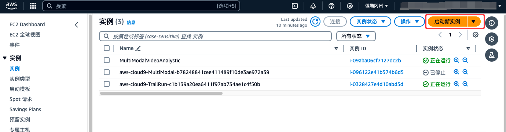

Set the EC2 Name to "MultiModalVideoAnalysticDeploy", select the instance image as "Amazon Linux 2023", type as "t3.large", storage 20GB, IAM with an Administrator EC2 permission. Keep the rest of the configuration as default, and click "Create". Wait for the creation to complete.

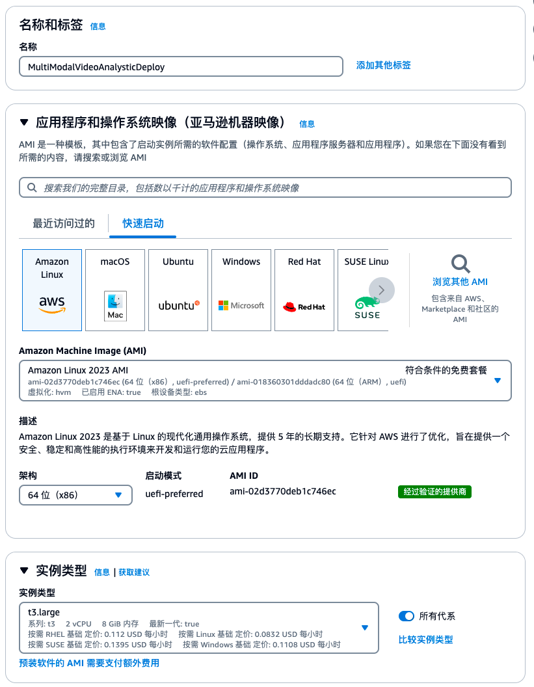
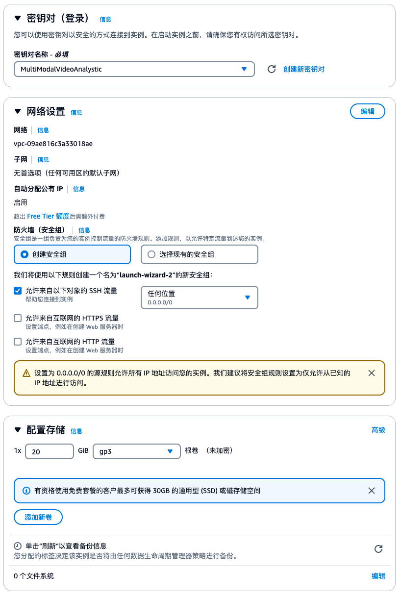
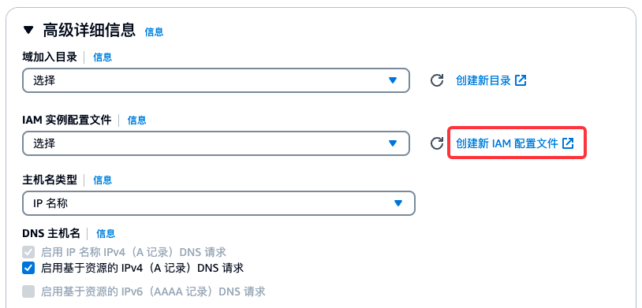
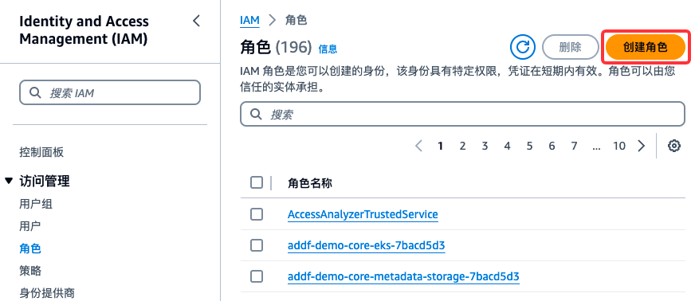
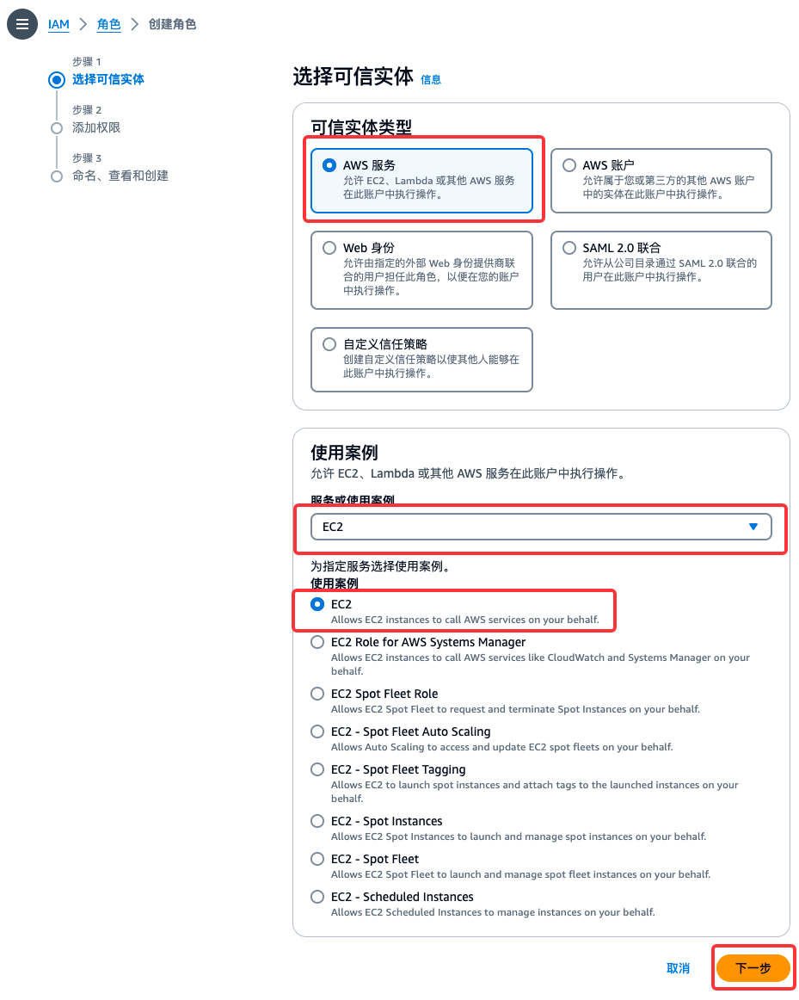
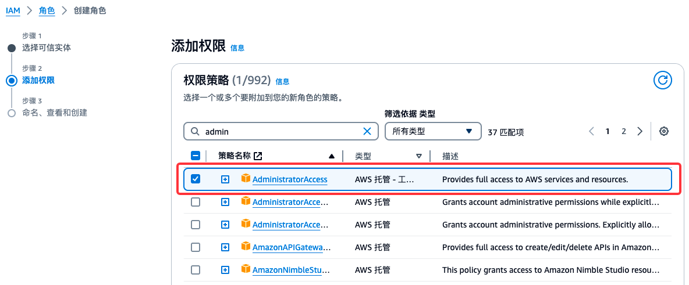
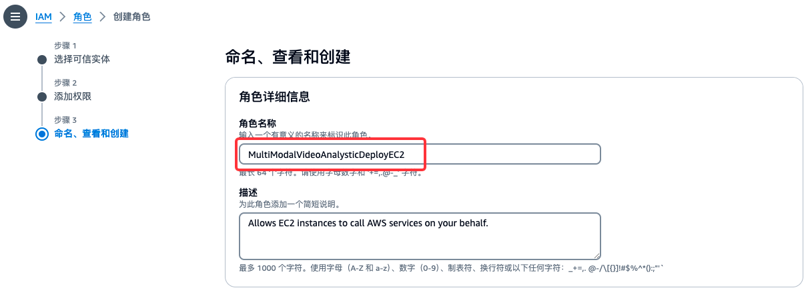
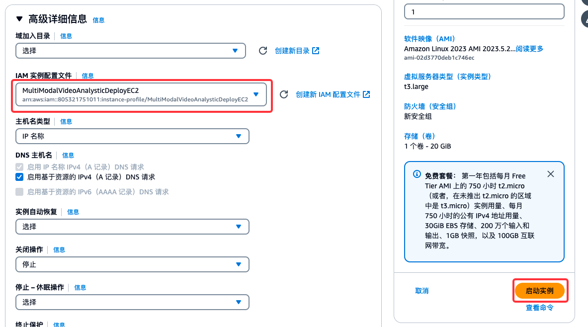

Login in the EC2

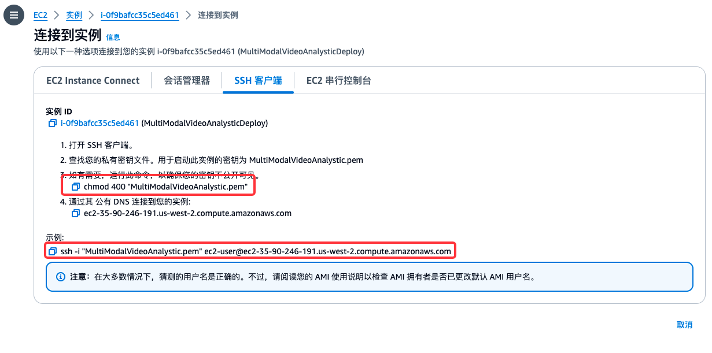
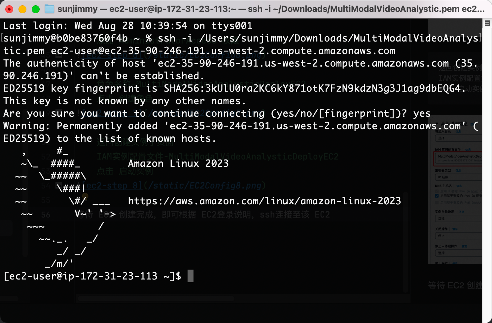
Upload the code repo  
```
scp -i <path to your-ec2.pem>  <path to guidance-for-multi-modal-video-analytics-main.tar.gz> ec2-user@ec2-xxx-xxx-xxx-xxx.us-west-2.compute.amazonaws.com:/home/ec2-user
```
For example, `scp -i /Users/sunjimmy/Downloads/MultiModalVideoAnalystic.pem  /Users/sunjimmy/Downloads/guidance-for-multi-modal-video-analytics-main.tar.gz ec2-user@ec2-xx-xx-xx-xxx.us-west-2.compute.amazonaws.com:/home/ec2-user`

Unzip the code
```
tar -xvf guidance-for-multi-modal-video-analytics.tar.gz
```

Build cdk and boto3 environment
```
sudo yum install python3-pip -y && \
sudo curl -sL https://rpm.nodesource.com/setup_18.x | sudo bash - && \
sudo yum install -y nodejs && \
sudo pip install aws-cdk.core && \
sudo pip install aws-cdk-lib constructs && \
sudo pip install --upgrade constructs && \
sudo pip install cdk-ecr-deployment && \
sudo python3 -m pip install --upgrade aws-cdk-lib && \
sudo npm install -g aws-cdk && \
pip install opensearch-py && \
sudo pip install boto3 && \
sudo yum install -y docker && \
sudo systemctl start docker
```
#### Deployment
```
cd guidance-for-multi-modal-video-analytics/deployment/cdk
sudo cdk bootstrap
sudo cdk deploy --all --require-approval never #if need ecs for long video analysis, add -c create_ecs_stack=true
```
the duration time is about 40 minutes.
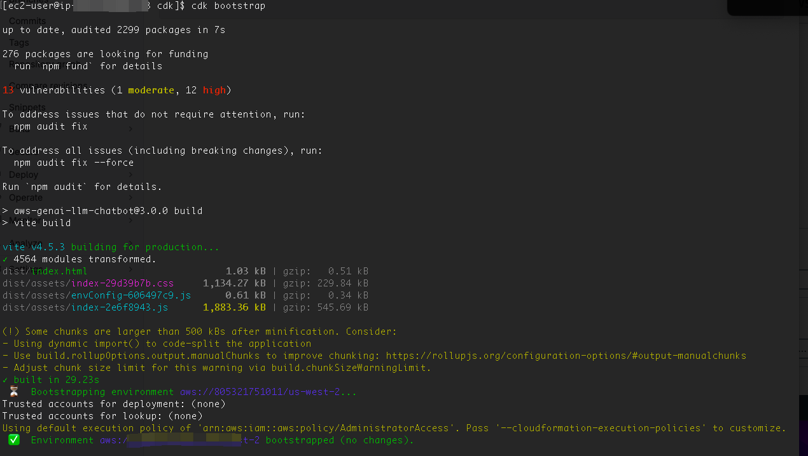
After cdk deploy is over, you will get many output parameters in console, record webappcloudfront.

Additional configuration
```
export AWS_DEFAULT_REGION=us-west-2   # or change to your actual region
python3 add_deployment.py 
```
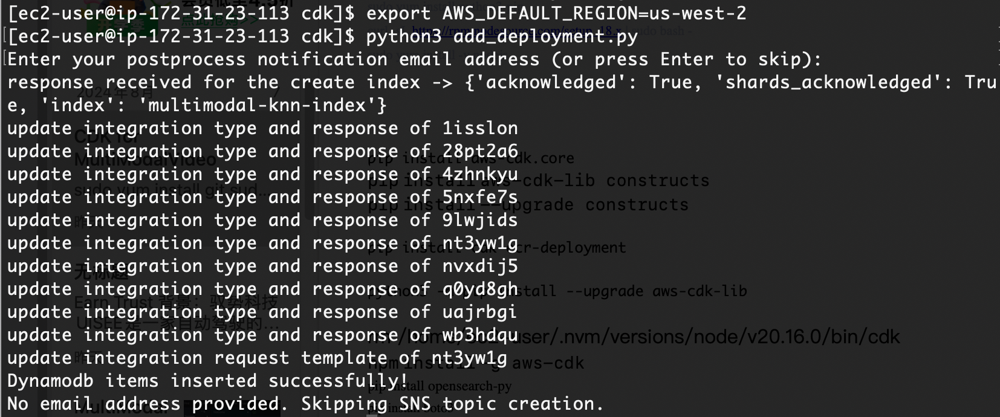
#### Usage
Go to login in the website
Enter the url webappcloudfront from browser, create an account, then you have completed the deployment

Video stream sample
If you want to test video stream as input resource, please check kvs_configuration_tutorial as a reference

#### Uninstall
If you want to uninstall the solution and release resources, please delete all the s3 content(bucket name started with multimodalvideoanalyticss) before uninstall.
```
sudo cdk destroy --all --require-approval never # if include ECS, add -c create_ecs_stack=true
```